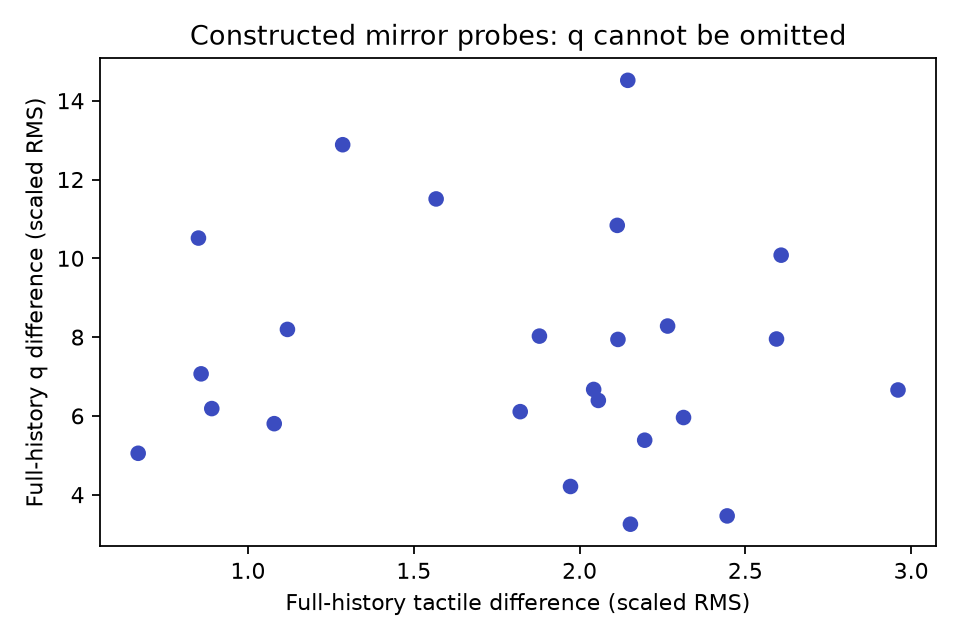
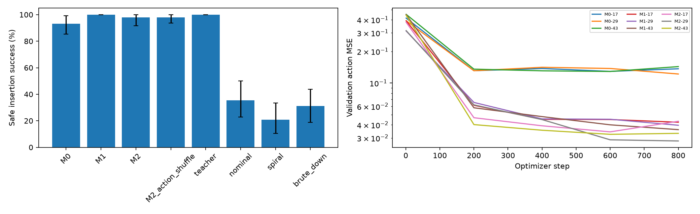

# Active tactile insertion Pilot 结果

**WEAK_SIGNAL / NO-GO**；决策 **REVISE**。A支持=True，B支持=False。这是缩小规模、单任务的探索性实验，不是最终论文测试。

## 安全闭环主比较

|条件|安全成功% [95%CI]|超力%|timeout%|深度mm|峰值接触力N|删失时延ms|搜索路径mm|
|---|---|---|---|---|---|---|---|
|M0|93.06 [85.42, 99.31]|1.39|5.56|8.78|4.56|495.3|4.65|
|M1|100.00 [100.00, 100.00]|0.00|0.00|8.41|4.35|288.1|4.22|
|M2|97.92 [91.67, 100.00]|0.00|2.08|8.23|4.39|323.2|4.42|
|M1_temporal_shuffle|98.61 [94.44, 100.00]|1.39|0.00|10.87|4.55|540.2|4.94|
|M2_temporal_shuffle|97.22 [91.67, 100.00]|0.00|2.78|9.89|4.53|486.4|5.09|
|M2_action_shuffle|97.92 [93.75, 100.00]|0.00|2.08|8.32|4.41|344.0|4.46|
|teacher|100.00 [100.00, 100.00]|0.00|0.00|8.43|4.35|272.6|4.08|
|nominal|35.42 [22.92, 50.00]|0.00|64.58|7.30|4.59|1410.0|2.61|
|constant_x|14.58 [6.25, 25.00]|31.25|54.17|3.10|6.47|1410.7|6.74|
|spiral|20.83 [10.42, 33.33]|79.17|0.00|6.75|7.60|1357.7|6.90|
|brute_down|31.25 [18.75, 43.75]|68.75|0.00|7.22|7.61|1125.0|2.61|

主评估均为新hole offset与probe sequence的IID种子，未做范围外泛化。CI对训练初始化及配对task seed同时bootstrap；3个初始化共享数据，不是独立采集。全成功/全失败的bootstrap区间退化不能证明总体概率为1/0；48/48全成功的单seed Wilson下界约92.6%。其他指标完整CI/SD见metrics.csv。

- A_M1_minus_M0: 6.94 [0.69, 14.58] pp；各training seed差值[8.33, 4.17, 8.33]
- B_M2_minus_M1: -2.08 [-8.33, 0.00] pp；各training seed差值[-6.25, 0.0, 0.0]
- M2_minus_action_shuffle: 0.00 [-4.17, 3.47] pp；各training seed差值[-2.08, 2.08, 0.0]
- M1_minus_temporal_shuffle: 1.39 [0.00, 5.56] pp；各training seed差值[0.0, 2.08, 2.08]
- M2_minus_temporal_shuffle: 0.69 [0.00, 4.17] pp；各training seed差值[0.0, 2.08, 0.0]

主要门槛：至少5pp改善、CI下界>0、三个training seed均正；B还须action shuffle及足量全T/q匹配分支同时通过。不能用较低BC误差替代闭环收益。

## 主动probe与歧义诊断

构造 24 对镜像孔位/动作历史，但仅 0 对满足完整61步T/q匹配门槛（最低10对）。未删q或重排触觉channel来制造匹配。
- 所有镜像样本 M2: 97.22 [91.67, 100.00]%（描述性，不能代替匹配子集）
- 所有镜像样本 M1: 99.31 [96.53, 100.00]%（描述性，不能代替匹配子集）
- 所有镜像样本 M0: 84.03 [70.83, 95.83]%（描述性，不能代替匹配子集）
合格子集M2−M1：未建立 pp。


q历史重建上一下发动作：validation R²=0.755，非微小action分量方向准确率=89.60%。这是只读diagnostic，不是student新增特征；说明必须检查“q能告诉模型怎样运动”这一替代解释，不单凭此宣称信息完全等价。

原始pair距离、teacher方向、是否合格见diagnostics/pairs.json，physics snapshot见bank.pt。只看T_history相似而忽略q_history，不构成本实验M1/M2的信息隔离对照。镜像构造若不满足完整观测匹配，就如实判定没有建立所需歧义，而不是跑完后扩大阈值。



## 输入与物理限制

实际物理为三轴Cartesian夹持工装，两个内侧pad与圆截面带半球导入端peg接触；T为pad/shaft几何压入量map。它不是FR3完整链路、RGB触觉、wrench投影或真实传感器标定。q仅三轴encoder，绝无隐藏孔位、被动peg/mount位置、摩擦、速度或接触标签进入student。teacher特权仅生成动作label及evaluation。

孔为24片凸几何近似圆倒角孔，使用软接触；这限制对精密刚性装配/真实材料的推广。插入深度8mm包括5mm圆鼻，圆柱段越过1.5mm倒角喉部约1.5mm。安全力为所有peg-hole接触力模长之和，1ms监测；超8N即终止，不允许超力后成功。probe有统一encoder竖直限位，主phase固定1.5N向下preload、只控制Δx/Δy。接触工装缩小了运动规划变量，但并非高保真光学触觉系统。

## 数据、计算与完整性

训练80 episodes / 4382个非terminal teacher targets；validation 16 episodes；零target train episodes=0。主test task seeds=48，训练初始化=[17, 29, 43]。主rollout数=1104；所有镜像分支rollout数=432。原始失败完整保留在failures.json，逐trajectory输入/下发action/log见traces。

三方法参数量一致：[278466]；各800steps，batch=64，固定最终checkpoint。validation只记录，不选模。时间、配置、数据、normalizer与checkpoint均有hash；resume禁止改冻结输入。

普通条件prefix force failures（跨条件重复计数）=0，prefix success=0。是否存在执行异常文件：False。所有episode均进入结果，没有按成功率补抽seed。No-contact prefix比例等见原始metrics，不能把无接触经验描述为触觉识别。

## 解释与最小下一步

当前数据没有证明在完整T/q历史之上加入past action能带来可重复的安全插入收益。M1−M0达到预定门槛。随机probe使交互丰富，但不能保证命令与encoder历史提供独立信息；被动对中、BC覆盖不足、teacher特权不可观测或时序分布偏移仍是替代解释。

下一步先用少量新的development seeds检查实际任务中被阻挡/顺应运动能否形成“完整T/q历史相似、issued command不同且安全可行动作相反”的状态对。若不存在，修订科学问题为interaction-conditioned控制的工程价值，或研究明确且真实的执行器内部状态；不得隐藏q让M2胜出，也不直接扩大Transformer/转第二孔型。

## 图与复现



硬件/软件：
```json
{
  "python": "3.12.3",
  "platform": "Linux-7.0.0-34-generic-x86_64-with-glibc2.39",
  "torch": "2.8.0+cu128",
  "mujoco": "3.10.0",
  "numpy": "2.2.6",
  "cuda": "12.8",
  "gpu": "NVIDIA GeForce RTX 5060 Laptop GPU",
  "device": "cuda",
  "collection_processes": 4,
  "train_data_loader_workers": 0,
  "train_batch_size": 64
}
```
阶段耗时（秒）：
```json
{
  "collect": 1.539133034999395,
  "train": 26.03363922400058,
  "evaluate": 94.27006057299968,
  "diagnostics": 21.73559164499966
}
```
精确配置：
```yaml
version: active-tactile-insertion-pilot-v1
stage: Pilot
sample_ms: 5
history_ms: 300
probe_ms: 300
settle_ms: 350
horizon_ms: 1600
physics_ms: 1
peg_radius_m: 0.005
hole_radius_m: 0.0054
chamfer_m: 0.0012
chamfer_depth_m: 0.0015
hole_depth_m: 0.012
hole_facets: 24
offset_radius_m:
- 0.0008
- 0.002
friction:
- 0.15
- 0.35
mass_kg:
- 0.045
- 0.065
motor_kp:
- 8000.0
- 12000.0
motor_damping: 100.0
mount_stiffness: 15000.0
mount_damping: 30.0
preload_n: 1.5
safe_force_n: 8.0
insertion_depth_m: 0.008
probe_depth_cap_m: 0.0055
success_hold_ms: 20
max_action_m: 4.0e-05
workspace_m: 0.006
probe_amplitude_m:
- 0.0002
- 0.001
probe_duration_ms:
- 30
- 90
tactile_grid: 4
tactile_extent_y_m: 0.01
tactile_extent_z_m: 0.012
tactile_sigma_m: 0.003
tactile_noise_m: 5.0e-07
tactile_quantum_m: 2.0e-06
q_quantum_m: 5.0e-06
model:
  hidden: 128
  layers: 2
  heads: 4
  ff: 256
  dropout: 0.0
train_seeds:
- 17
- 29
- 43
seed_starts:
  development: 1710000
  train: 1720000
  validation: 1730000
  test: 1740000
  ambiguity: 1750000
train_episodes: 80
validation_episodes: 16
eval_episodes: 48
train_steps: 800
train_batch_size: 64
eval_batch_size: 48
learning_rate: 0.0003
weight_decay: 0.0001
gradient_clip: 1.0
checkpoint_every: 200
cpu_threads: 4
workers: 4
device: cuda
bootstrap_samples: 4000
bootstrap_seed: 6182
minimum_effect: 0.05
ambiguity:
  seeds: 24
  tactile_scale_m: 1.0e-05
  q_scale_m: 5.0e-05
  rms_limit: 1.0
  linf_limit: 3.0
  cosine_max: -0.5
  min_pairs: 10
```

恢复：`env -u PYTHONPATH -u PYTHONHOME .venv-recording/bin/python -m experiments.active_tactile_insertion.run --resume /home/mingzhe/Documents/ws/robotic_infra/docs/research-results/active-tactile-insertion/20260930T031448344996Z-pilot`。
扩大预算的新run：`env -u PYTHONPATH -u PYTHONHOME .venv-recording/bin/python -m experiments.active_tactile_insertion.run --full-scale`；未执行，当前NO-GO不建议自动扩大规模。


补充：[POSTHOC_AUDIT.md](POSTHOC_AUDIT.md) 检查安全成功/动作时间对齐，并讨论history覆盖、时间顺序与q可重建动作的替代解释；未改变指标或实验。
