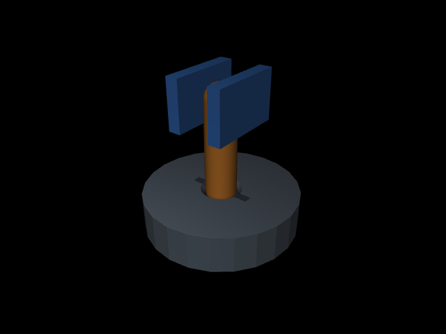

# 实际验证记录

## 测试与smoke

命令：

```bash
.venv-recording/bin/python -m pytest -q tests/test_active_tactile_insertion.py tests/test_tactile_history_control.py
```

结果：**19 passed**。其中新插入实验10项、上一闭环实验9项。覆盖参数公平/信息屏蔽、causal mask、实际teacher安全插入、逐物理步超力终止、触觉接口不读取force/teacher、命令时间对齐、真实MuJoCo状态恢复、shuffle、完整T/q匹配不可忽略q、数据窗口和seed分区。

完整smoke位于同级 `20260930T031358095718Z-smoke`，完成采集、训练、全部闭环条件、主动构造pair、动作重建diagnostic和四份报告；只有4步训练、4个test seed，不用于科学结论。

## 物理开发

早期平底圆柱与较硬接触出现瞬时碰撞力尖峰，12个开发seed中10个在prefix就失败。未开始学习前改为半球导入端圆截面peg及软接触；原始源码保留为insertion-environment-v1.py，开发失败从该源码重现并保存insertion-cylinder-reproduced.json。开发文件是探索记录，不称预注册。

最终使用统一的encoder竖直probe限位，避免接管前自动完成插入。16个最终开发seed均在prefix发生接触，无prefix超力/成功；teacher16/16，nominal8/16，constant+x1/16，spiral2/16，brute-down7/16且9/16超力。随后冻结全部任务与模型配置。

另外4个开发seed以1ms和0.5ms步长检查teacher：两种步长均4/4安全成功，峰值力分别约2.94–4.58N。半毫秒审计使用只将substep数量转为int的独立源码副本；原始生产配置仅使用整数1ms，未改冻结源码。脚本和副本随run保存。这是有限步长敏感性检查，不是材料/真机验证。

## 数据与冻结

training-audit.json核对9个模型全部278466参数、800 steps。train80 episodes/4382 targets，validation16 episodes/889 targets。全部存储x的两维action与上一实际下发命令逐项对齐，scene/source/config/dataset/normalizer/checkpoint哈希匹配。

T只取pad/shaft几何压入量，q仅carrier三轴encoder。被动peg mount状态、hole center、摩擦和接触wrench不进入student；hidden metadata与teacher/evaluation显式分离。



scene.png为真实开发seed物理状态的离屏渲染：蓝色两侧夹持pad，橙色圆截面peg，灰色24片近似圆倒角孔。没有完整FR3手臂或RGB触觉renderer。渲染最初请求800px超出默认640px framebuffer，改用640×480完成，仅影响展示，未改实验模型或数据。

## 完成后核验

`run --resume` 已实际执行通过，仅重建报告，跳过完成的采集/训练/评估；所有冻结源码、数据、normalizer及checkpoint保持相同哈希。随后执行只读 `audit_postprocess.py` 验证1104次主rollout、432次镜像分支以及实际命令对齐。

成功是1ms子步首次满足目标并保持20ms的事件，末状态按5ms控制周期保存。最初将每个末状态也要求完全满足0.4mm对中阈值的审计发现25例不一致；已用保存命令在原环境逐1ms回放，全部核实此前首次成功事件达到深度、对中、保持时间与安全力条件，末状态晚0–4ms。见event-audit.json及event_audit.py；没有修改成功标签或模型。后续版本宜直接保存成功事件快照，避免把采样末状态误认为事件状态。

正式指标与补充审计之间没有增加训练、重选checkpoint或修改匹配标准。
