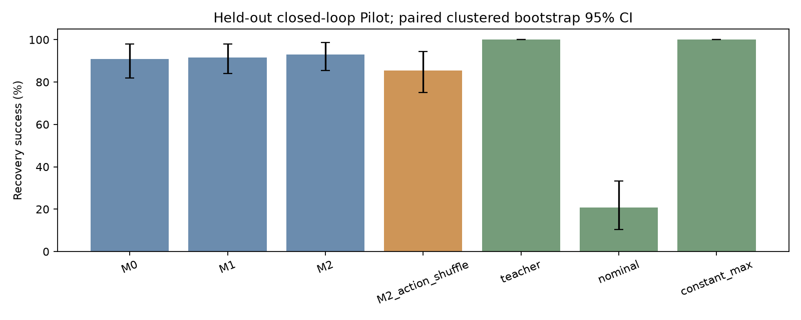
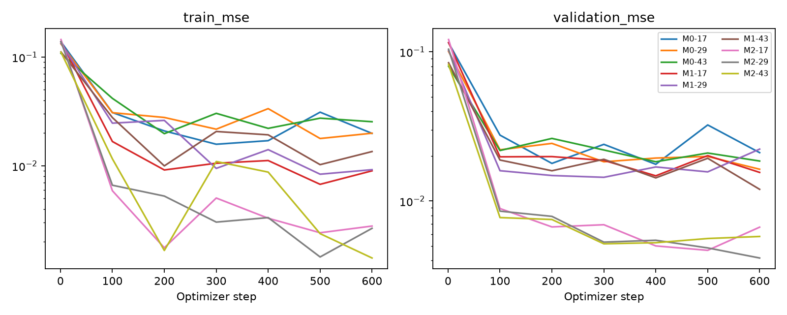

# 闭环 tactile history Pilot 结果

状态：**NO_SIGNAL**；决策：**REVISE**。A 支持=False；B 支持=False。本次为 reduced-scale exploratory Pilot，非论文最终测试。

## 闭环结果

未见扰动种子上独立运行全部策略和诊断，主结论不由training loss得出。均值跨训练种子；CI同时重采样训练初始化及配对扰动seed，保留条件配对。

|条件|成功 % [95% CI]|训练种子SD pp|掉落 %|最大滑移 mm|删失时延 ms|峰值单指力 N|平均收紧 mm|
|---|---|---|---|---|---|---|---|
|M0|90.97 [81.94, 97.92]|2.41|9.03|155.26|168.2|4.47|4.55|
|M1|91.67 [84.03, 97.92]|2.08|6.94|120.52|161.4|4.49|4.71|
|M2|93.06 [85.42, 98.61]|1.20|6.25|92.15|152.6|4.35|5.20|
|M1_temporal_shuffle|88.19 [78.47, 96.53]|3.18|11.81|185.76|188.4|4.53|4.95|
|M2_temporal_shuffle|87.50 [75.69, 97.22]|7.51|11.81|189.66|190.7|4.50|5.62|
|M2_action_shuffle|85.42 [75.00, 94.44]|4.17|12.50|197.85|202.7|4.38|5.15|
|teacher|100.00 [100.00, 100.00]|0.00|0.00|4.03|105.5|3.87|3.65|
|nominal|20.83 [10.42, 33.33]|0.00|79.17|1456.20|648.8|4.08|0.00|
|constant_max|100.00 [100.00, 100.00]|0.00|0.00|1.01|97.5|5.29|12.00|

每个指标的CI和训练种子SD均在 metrics.csv / summary.json；全成功/全失败时percentile bootstrap会退化，不能据此声称总体概率确定。48/48全成功的单seed Wilson 95%区间约92.6%–100%，显示有限样本不确定性。时延失败样本右删失到episode结束，不能当作全部成功恢复时间。max slip含掉落后的位移，不能解释成接触内微滑移。

训练种子顺序 [17, 29, 43]：
- M0: [89.58, 89.58, 93.75] %
- M1: [89.58, 91.67, 93.75] %
- M2: [93.75, 91.67, 93.75] %

## 预先定义的核心差值

- A_M1_minus_M0: 0.69 [-4.17, 6.25] pp；各训练种子差值 [0.0, 2.08, 0.0]
- B_M2_minus_M1: 1.39 [-4.17, 8.33] pp；各训练种子差值 [4.17, 0.0, 0.0]
- M2_minus_action_shuffle: 7.64 [1.39, 15.28] pp；各训练种子差值 [8.33, 10.42, 4.17]
- M1_minus_temporal_shuffle: 3.47 [-1.39, 9.72] pp；各训练种子差值 [4.17, 4.17, 2.08]
- M2_minus_temporal_shuffle: 5.56 [-2.08, 14.58] pp；各训练种子差值 [12.5, 6.25, -2.08]

A/B均要求≥5pp、95%CI下界>0、各训练种子方向一致。B还要求action shuffle和匹配子集同时通过。此Pilot无差异不构成等效性证明。

## 近当前观测匹配分支

按冻结规则找到 7 对（最少要求 10），来自独立的 ambiguity seeds；未在评估后放宽阈值。
- M2: 成功率 73.81 [57.14, 92.86]%；初始 teacher action 绝对误差 0.42 [0.28, 0.54]。
- M1: 成功率 71.43 [57.14, 92.86]%；初始 teacher action 绝对误差 0.17 [0.10, 0.26]。
- M0: 成功率 76.19 [57.14, 92.86]%；初始 teacher action 绝对误差 0.26 [0.15, 0.38]。

M2−M1 配对成功率差：2.38 [0.00, 9.52] pp。 样本不足，Hypothesis B 的 ambiguity 条件未建立。

pair距离/teacher gap见 ambiguity/pairs.json，最近但未必合格候选见 nearest.json，完整恢复状态见bank.pt。teacher gap是启发式动作差异，不是已证明的最优动作差异。匹配阈值允许多个量化档位差异，属于近观测诊断，不能证明观测严格混叠。所有模型从相同保存状态/历史开始闭环运行。匹配组为单独诊断，不替代主test。

## 数据、训练与失败

训练 72 episodes，validation 16，每episode 240 targets，共 17280 训练targets。test 48 distinct seeds × 3 model initializations ×6 learned conditions，外加3种参考策略各48集；ambiguity bank 96集及合格匹配分支。所有原始episode指标保留。

相同参数量：[279041]；相同步数 600，AdamW lr 0.0003，batch 64；M0重复当前观测、M1/M0置零action通道。固定最后checkpoint，无test选模。

初始化失败计数（包含重复条件）0；正式执行失败文件存在：False。

恒定最大收紧成功率 100.00%，是否达到/超过最佳学习策略：True。这是任务可被简单控制解决的直接替代解释；不能仅凭teacher恢复成功就宣称历史必要。

## 限制与下一步

只验证刚体 MuJoCo、几何压入量 taxel 和一个 known-pose 单块任务；teacher 仅启发式而非最优控制。共享训练数据的3个初始化不能代表3套独立数据采集。固定600步预算可能欠拟合；BC状态分布偏移、无真实RGB触觉/真机证据，均限制推广。

若B未通过：当前任务没有证明 past action history 的独立价值。若A未通过：当前任务不足以支持temporal history的闭环改善，更不能声称必要。下一步先检查task/teacher在安全接触力约束下是否存在必须区别处理的近观测状态；只做小规模物理诊断，用新development seeds；不扩大网络、不基于本test反复调参。

## 图、运行与复现




硬件/依赖：
```json
{
  "python": "3.12.3",
  "platform": "Linux-7.0.0-34-generic-x86_64-with-glibc2.39",
  "torch": "2.8.0+cu128",
  "mujoco": "3.10.0",
  "numpy": "2.2.6",
  "cuda": "12.8",
  "gpu": "NVIDIA GeForce RTX 5060 Laptop GPU",
  "train_batch_size": 64,
  "num_workers": 4,
  "device": "cuda"
}
```
阶段计时（秒）：
```json
{
  "collect": 12.79707118899978,
  "train": 23.75850585499984,
  "evaluate": 459.5230188360001
}
```

本次精确配置：
```yaml
version: tactile-history-control-pilot-v1
stage: Pilot
sample_ms: 5
history_ms: 300
start_ms: 2400
end_ms: 3600
nominal_width_m: 0.032
max_closure_m: 0.012
mass_kg:
- 0.055
- 0.075
friction:
- 0.45
- 0.8
initial_offset_m: 0.0003
disturbance_n:
- 1.5
- 4.0
onset_ms:
- 2500
- 2800
duration_ms:
- 80
- 250
ramp_ms: 20
tactile:
  grid: 4
  extent_x_m: 0.015
  extent_z_m: 0.02
  splat_sigma_m: 0.006
tactile_noise_m: 1.0e-06
tactile_quantum_m: 5.0e-06
arm_quantum_rad: 1.0e-05
finger_quantum_m: 1.0e-05
teacher:
  base: 0.05
  displacement_gain: 90.0
  speed_gain: 4.0
success:
  max_slip_m: 0.025
  drop_displacement_m: 0.04
  min_height_m: 0.46
  stable_speed_m_s: 0.005
  min_force_n: 0.15
  stable_ms: 100
model:
  hidden: 128
  layers: 2
  heads: 4
  ff: 256
  dropout: 0.0
train_seeds:
- 17
- 29
- 43
train_episodes: 72
validation_episodes: 16
eval_episodes: 48
seed_starts:
  development: 910000
  train: 920000
  validation: 930000
  test: 940000
  ambiguity: 950000
train_steps: 600
train_batch_size: 64
eval_batch_size: 48
learning_rate: 0.0003
weight_decay: 0.0001
gradient_clip: 1.0
checkpoint_every: 100
cpu_threads: 4
workers: 4
device: cuda
bootstrap_samples: 4000
bootstrap_seed: 6182
minimum_effect: 0.05
ambiguity:
  seeds: 24
  variants: 4
  anchor_after_onset_ms: 80
  tactile_tolerance_m: 2.5e-05
  arm_tolerance_rad: 0.0001
  finger_tolerance_m: 0.0001
  rms_limit: 1.0
  linf_limit: 3.0
  teacher_gap: 0.15
  min_pairs: 10
```

恢复原运行：`env -u PYTHONPATH -u PYTHONHOME .venv-recording/bin/python -m experiments.tactile_history_control.run --resume /home/mingzhe/Documents/ws/robotic_infra/docs/research-results/tactile-history-control/20260930T023929113268Z-pilot`。
扩大预算的新run命令：`env -u PYTHONPATH -u PYTHONHOME .venv-recording/bin/python -m experiments.tactile_history_control.run --full-scale`（没有执行；需先明确task诊断是否值得加大规模，新seed分区，不把已看过Pilot test当作未见数据）。source/commit/diff/config/protocol/hash均保存在run中。


补充只读审计：[POSTHOC_AUDIT.md](POSTHOC_AUDIT.md) 包含全部失败分类、逐pair比较，以及一个分支前已超过成功位移阈值的样本限制；未删样本或修改结论。
