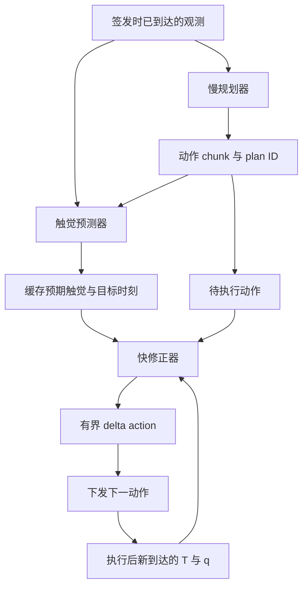

# [ARCHIVED PLANNING NOTE] 执行时触觉反馈与在线动作修正

更新日期：2026-09-30。当前状态：**已冻结，不再作为 `robotic_infra` 的 active roadmap。**

> 2026-09-30 仓库职责重置后，`robotic_infra` 仅维护通用基础设施。本文件保留为当时的研究规划与 provenance，不授权在本仓库继续 R0/R1/R2/R3、prediction head 或 architecture search。若该问题经新的 literature-first review 后仍值得研究，应迁移到独立 research repository。参见 [Research / Infrastructure Boundary](../RESEARCH_BOUNDARY.md)。

以下内容按当时版本保留，不代表当前研究决策。

## 1. 当前主问题与转向依据

> **Does execution-time tactile feedback improve an already planned action?**
>
> 当动作已经规划出来以后，执行过程中更新的触觉，能否安全地纠正尚未执行的动作？

研究主线从“past action history 是否有独立增益”转向 **execution-time tactile correction**。长期目标仍是低频任务/语义规划与高频触觉反馈协作；第一版只研究接触控制，不引入 VLA，也不把普通轨迹规划器称为已具备语义能力。

| 已完成实验 | 主要证据 | 对当前决策的作用 |
|---|---|---|
| [Disturbed grasp recovery](../research-results/tactile-history-control/20260930T023929113268Z-pilot/RESULTS.md) | M1−M0 +0.69 pp、M2−M1 +1.39 pp，区间均跨零；constant-max 100% | NO_SIGNAL / REVISE；任务允许简单强夹持解法，不再围绕它扩展 history 方法 |
| [Active tactile insertion](../research-results/active-tactile-insertion/20260930T031448344996Z-pilot/RESULTS.md) | M0 93.06%、M1 100%、M2 97.92%；M1−M0 **+6.94 pp [0.69,14.58]**，M2−M1 **−2.08 pp [−8.33,0]** | history 内容有有限 Pilot 信号；不支持在完整 T/q history 之上增加 past action 的独立收益 |
| [插入补充审计](../research-results/active-tactile-insertion/20260930T031448344996Z-pilot/POSTHOC_AUDIT.md) | q 增量重建上一命令：R²≈0.755，方向准确率89.60%；M1时间打乱仍98.61%；完整 T/q 匹配对0/24 | q 是强替代信息；不能声称已学习接触 Jacobian、时间顺序必不可少，或 action 在所有任务都无用 |

插入是三轴 Cartesian 工装、圆导入端 peg、分片倒角孔与双指几何压入量触觉代理；不是完整 FR3、光学触觉或真实硬件结果。48个共享环境种子、3个训练初始化不能当作144个独立环境。已有 test 已参与此次方向决策，后续必须标为探索性证据。

**优先级变化：**保留 I001、ContactBelief 和两轮闭环 Pilot 的源码、负结果与审计；不再为了让 M2 胜出删掉 q、增加网络或扩展搜索。旧冻结报告里的“下一步”是当时记录，当前下一步以本文为准。

## 2. 三篇相关工作的角色

以下核对依据为2026-09-30可访问的作者官方仓库、论文摘要与项目页。只借机制，不把组合这些已知机制当作已验证的新颖贡献。

| 工作 | 已核实的机制 | 本仓库拟借鉴的部分 |
|---|---|---|
| [T-Rex](https://github.com/ZhuoyangLiu2005/T-Rex) / [论文](https://arxiv.org/abs/2606.17055) | variable-rate MoT：约5 Hz慢动作生成、约20 Hz触觉细化；temporal tactile VQ-VAE编码时序力/形变 | 慢规划与快触觉的频率分工；保留近期接触历史 |
| [TacForcing](https://arxiv.org/abs/2608.25798) / [作者项目页](https://88runaway-tacforcing.static.hf.space/index.html) | streaming action expert在执行中接入新触觉；EATA约束新触觉直接作用于临近执行的动作块 | 执行过程中刷新观测，显式对齐观测时间与执行位置 |
| [TacPAC](https://github.com/LogosRoboticsGroup/TacPAC) / [论文](https://arxiv.org/abs/2609.05266) | 缓存预测接触及相应动作表示的逐层KV；新触觉读取缓存，单次前向修正未执行后缀 | 以计划预期为参考解释实际接触，复用计划上下文 |

TacForcing本身用streaming expert替换标准action expert，不能说它就是额外外挂的快控制器。TacPAC的“实际与预期比较”通过缓存条件化实现；本文下面的显式 `T − T_hat` 是本仓库拟测的简化实现，不是其原论文公式复现。T-Rex的5/20 Hz也不等于我们拟采用的20/200 Hz。此次未复现三篇模型或完成全面novelty检索；与它们处于相关问题范畴，不代表能力或证据等级相当。

## 3. 第一版结构：慢计划 + 快修正

工作描述：**Tactile Prediction-Guided Online Action Refinement**，暂作方向名。

在计划签发时刻 s：

\[
A^{(s)}=\pi_{slow}(o_{\leq s}),\qquad
\hat T^{(s)}=g(o_{\leq s},A^{(s)})
\]

执行到时刻 t 后，对齐同一物理时间及传感器坐标：

\[
e_t^T=T_t-\hat T_t^{(s)},\qquad
\Delta a_t=\pi_{corr}(T_{recent},q_{recent},e_{recent}^T,A^{(s)}_{remain})
\]

\[
a_t^{exec}=\operatorname{limit}(a_t^{planned}+\Delta a_t)
\]

这里 `limit` 同时约束动作幅度、工作空间与残差幅度；所有条件共用安全终止逻辑。第一版只修正下一个尚未下发的 Δx/Δy，固定向下 preload。整个后缀更新留到最小机制成立之后。

初始候选为20 Hz规划、200 Hz触觉/修正、1 kHz物理安全检查；这是仿真调度目标，**不是已经测得的200 Hz端到端推理能力**。每50 ms规划一次，对应10个5 ms动作。第一版可取 K=10；若延长预测chunk而仍20 Hz重规划，必须固定每次实际执行的前缀长度及后缀替换规则，不能把从未执行的长后缀算成闭环证据。训练小型Transformer/ACT式chunk policy即可，先不引入flow matching或大模型。

## 4. 按两个独立 Pilot 推进

### Pilot A：新鲜触觉是否改善既定计划？

- **Question：**固定同一个慢规划器，chunk执行期间更新T是否改善安全成功率？
- **Hypothesis：**fresh tactile correction优于相同修正器的chunk-start stale tactile条件。
- **Strong alternative：**只是更高动作更新频率、更多参数、q反馈或额外训练数据在起作用。
- **Primary comparison：**同架构、同预算的 fresh-current T 与 stale T 修正器；二者都获得相同频率的新q、相同剩余计划和执行索引。Base chunk作为实际收益参照。
- **Failure condition：**refresh不能稳定提升，或简单q-only/固定反馈规则解释全部收益，则诊断并REVISE，不自动训练预测器。

### Pilot B：预期接触是否改善反馈解释？

仅当A出现可重复信号后进入。

- **Question：**固定慢规划器和近期T/q输入，prediction-conditioned correction是否优于raw tactile history correction？
- **Hypothesis：**学到的计划条件触觉预测帮助修正同一计划，在安全成功率上优于raw history。
- **Strong alternative：**额外容量、额外监督、平滑/归一化，或只需历史触觉；预测误差不含新的传感器信息。
- **Primary comparison：**下表R3对R2，同数据、同修正架构/容量、同更新与执行频率；预测器训练和推理成本单列。
- **Failure condition：**R3没有稳定优势，或persistence/打乱预测同样有效，则不保留“学到的预期接触有独立价值”的主张；仍可保留A的工程反馈结论。

| 条件 | chunk执行中的信息与动作 | 作用 |
|---|---|---|
| R0 Base chunk | chunk签发后按计划执行，下一规划时再看观测 | 固定主干参照 |
| R1 + current tactile refresh | 当前T、共享q历史、剩余计划、执行索引 → 有界残差 | 新鲜接触反馈 |
| R2 + tactile history | 近期T、同一q历史与剩余计划 → 同架构残差 | raw history强基线 |
| R3 + prediction-error refinement | R2信息 + 对齐的预期T及显式误差 → 同架构残差 | 待检验的预测条件化 |

R0–R3是目标结构的总览，不要求首轮同时训练所有条件。A先做R0、stale、R1和q-only/简单反馈；B再在已确定设置比较R2/R3。对比R1/R2时q历史保持相同，防止把本体历史增益误归于触觉历史。

B至少保留两个辨别性控制：`raw T + predicted T`（无显式减法）与persistence预测；预测打乱/时间错位作为诊断。因为 `e=T−T_hat` 是确定性重参数化，R3超过raw T只能说明预测条件信息/结构有用；只有超过拥有相同T和T_hat的拼接对照，才支持显式差分形式的额外价值。若需要增加控制条件，分批进行，避免一次大型网格。

## 5. 时序和信息合约

1. 每条观测记录采样时刻、到达时刻；策略只能读已到达且不晚于决策时刻的数据。保存plan ID、签发时刻、预测目标时刻、执行索引；禁止future-context。观测T_t先反映此前已执行动作，再决定下一个动作，不能拿未来T作为当前误差。
2. 预期T在计划签发时用当时信息和原计划生成并缓存。离线未来T可作为训练标签，不可在部署时teacher-force到预测输入。normalizer只拟合train。
3. 第一次修正后，实际轨迹可能偏离原计划。第一版缓存保持不变，误差表示相对原计划的偏差，包含修正自身造成的变化，不能全解释成外界扰动。重预测作为独立变体，明确重置plan ID和预测有效区间。
4. 已执行或已提交控制队列的动作不可追溯更改；分别记录planned、corrected、issued、executed/实际运动，避免把命令当作实际位移。切换计划须有原子边界；时延/丢帧条件采用相同规则。
5. 孔位、摩擦、被动peg状态和真值contact wrench只进入teacher标签、任务生成与评估。student及预测器都不读这些特权状态；不隐藏q来人为产生触觉收益。
6. 离线修正标签应来自在该实际到达状态重新查询的teacher动作减去当时原计划动作；不直接相减两条不同状态的expert轨迹。先冻结base与预测器，再训练修正器；所有对照共享已收集数据和划分。teacher标签不可观测时的学习难度要报告。
7. 新版本直接保存1 ms首次成功事件快照，另存5 ms采样末状态。旧实验25例边界事件的重放审计保留，不回改成功标签。

## 6. 最小任务与评估边界

沿用active insertion工装，但现有M1已100%，不能直接拿饱和设置判断新修正机制。先用少量**新的development seeds**检查：原有接触动态及观测变旧是否已足够暴露chunk失效；若不足，再引入计划签发后、幅度受控且物理连续的外部侧向扰动。扰动时间/幅度对各方法配对，训练与评估都明确定义，禁止瞬移孔位或通过硬碰撞尖峰制造收益。

Pilot起步建议为80 train / 16 validation / 48 held-out任务种子、3训练初始化的上限量级，可先更小smoke。在开发阶段确定扰动、chunk跨度、反馈时延与可行teacher上限，再冻结配置生成评估种子；此处不是已经执行的预注册。新seed区间必须与旧两轮和I001/ContactBelief不交叉。

唯一主指标是**时限内安全插入成功率**：保留8 N逐物理步安全终止及插入深度/保持要求。超力率、失败类型、删失完成时间、P50/P95反馈时延与超时率作为诊断；预测MSE或误差相关性不能代替闭环收益。新增残差控制不得获得更大的总动作幅度或向下驱动力。

候选推进门槛：配对安全成功率提高至少5 pp、95%配对bootstrap区间下界>0、3个训练初始化方向一致；按环境种子配对并报告初始化变异，不将共享任务重复计数成独立样本。门槛应在运行前写入新协议；小样本未通过可判WEAK_SIGNAL，而非宣称机制普遍无效。反复看过的开发评估不能升级为独立final test。

另做新鲜/延迟触觉和q-only控制，以区分触觉内容与执行频率。若简单反馈已达到同等效果，报告这一结果。若base与teacher都很差，先修任务/数据覆盖；若所有方法都饱和，先修评估可辨别性，不能继续加模型追求差异。

## 7. 当时的决策与下一项交付（现已冻结）

**Decision：REVISE → 新的execution-time feedback Pilot。** 既有action-history主线暂停扩展，负结果保留。A成立后才评估B；B成立后再讨论第二任务、泛化或公开基准，不自动跳到paper evaluation。

最小下一步是一个可重放的chunk执行与观测到达调度器，加同一计划下fresh/stale反馈的少量开发对照；优先证明“新触觉确实来得及改变未执行动作”。再形成独立实验目录及冻结协议。此文档不表示上述模块、训练、性能或新颖性已经验证。
